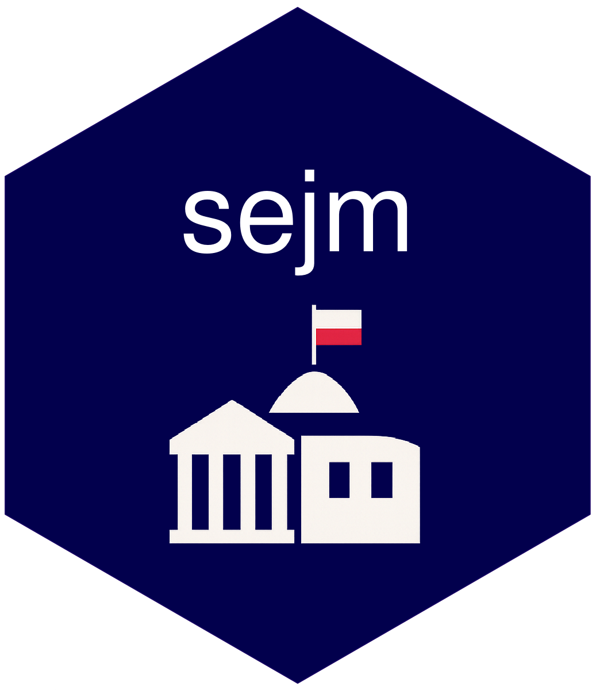

<!-- README.md is generated from README.Rmd. Please edit that file -->

```{r, include = FALSE}
  knitr::opts_chunk$set(
    collapse = TRUE,
    comment = "#>",
    fig.path = "man/figures/README-",
    out.width = "100%"
)
```

# `{sejm}` 

<!-- badges: start -->
[](https://lifecycle.r-lib.org/articles/stages.html#experimental)
<!-- badges: end -->

THe package provides convenience functions to access Polish sejm API 
and retrieve information on parties, MPs, votes, interpellations, committees etc.

It also provides a shiny app to interactively browse information on Polish sejm.

## Installation

You can install the development version of `{sejm}` like so:

```{r}
remotes::install_github("mic-wypych/sejm")
```

## Run

You can launch the application by running:

```{r, eval = FALSE}
sejm::run_app()
```

## About

You are reading the doc about version : `r golem::pkg_version()`

This README has been compiled on the

```{r}
Sys.time()
```

Here are the tests results and package coverage:

```{r, error = TRUE}
devtools::check(quiet = TRUE)
```

```{r echo = FALSE}
unloadNamespace("sejm")
```

```{r, error = TRUE}
covr::package_coverage()
```
